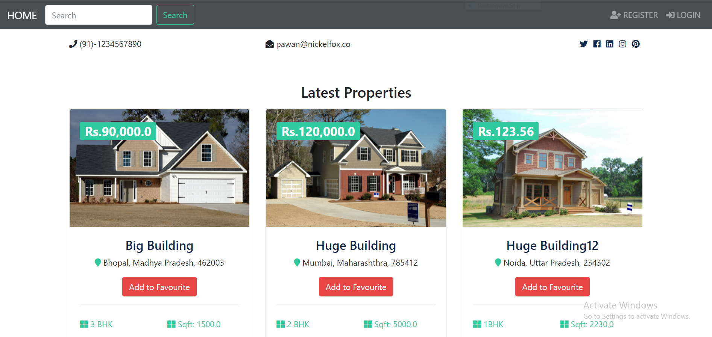

# Property Listing System
Property listing system is a real estate website for buying and selling houses.Any user can register and make a listing for selliing and buying a property.

# About Project
In this project, we have two types of user Buyers and Sellers.Buyer and seller both can register, login, changepassword and logout.After login, Seller can view only their published / unpublished properties.
Seller can add new property and choose to publish or unpublish it.Seller can edit any property, it's attributes, and make property state publish / unpublished and can also view any property like a normal Buyer.
After login, Buyer can view all the published property by all Sellers.

## Features
 - **Feature #1** (Buyer / Seller Registration)
     -  Buyer and seller can register itself.
 - **Feature #2** Buyer / Seller Reset password)
     - Buyer and Seller can reset password.
 - **Feature #3** (Add the property)
     - Seller can add the property . 
 - **Feature #4** (View the property)
     - Guest, as well as registered Buyer can view the property.
 - **Feature #5** (View seller contact)
    - Buyer can view upto 3 seller contacts in a day.
 - **Feature #6** (Download brochure PDF)
    - Buyer can download property brochure PDF.
 - **Feature #7** (View saved properties)
    - Buyer can view their saved properties.
 - **Feature #8** (View saved properties)
   - Buyer can set criteria for receiving property notification alert.
 - **Feature #9** (Notification on new property publish)
   - Buyer can receive the notification when any new property gets published with their set criteria.

 - **Frontend / Template :**
      -  **Registration screen (for Seller and Buyer)**
         - **Seller Screens :**
            - After login Seller can view only their published / unpublished properties.
            - Seller can add new property and choose to publish or unpublish it.
            - Seller can edit any property, it's attributes, and make property state publish / unpublished.
            - Seller can also view any property like a normal Buyer.
     
         - **Buyer Screens :**
            - After login Buyer can view all the published property by all Sellers.
            - Buyer can navigate to own profile for setting property criteria from the top nav bar.
            - Buyer can navigate to any Seller from the property page. (There they will see all the published property by that Seller).
            - Buyer can view upto 3 seller contacts from the property page in a day.
 
          - **Guest Buyer Screens :**
            - Guest user can just navigate and view all the published property.They cannot access profile page or seller contacts.
   
  - [Refer all the property attribute in this link (99acres)](https://www.99acres.com/maxima-by-oberoi-realty-jvlr-mumbai-andheri-dahisar-npxid-r311075?src=SRP&preferences=RESALE)
      - [Refer all the property attribute in this link (magicbricks)](https://www.magicbricks.com/property-for-sale-rent-in-New-Delhi/residential-real-estate-New-Delhi)
     
### Tech Stack
 - Python, Django,Html, CSS, Bootstrap

## Output

 

## Acknowledgements/Prerequisites
- **Python IDE**
   - [VS Code (Visual Studio Code)](https://code.visualstudio.com/docs/?dv=win)
   - Install following extensions : -
       - Python
       - Code runer
- [Download Python and Install](https://www.python.org/downloads/)
- python.exe path must be set in 'path' environment variable
- For more details link are given below:-
  - [How to download Python and Pycharm](https://www.youtube.com/watch?v=mbryl4MZJms&ab_channel=Telusko)
  - [Download Pycharm](https://www.jetbrains.com/pycharm/download/#section=windows)

### Some Basic Commands ###
- To check python latest version: `` python --version ``
- To check pip: `` pip --version `` 
- To check all packages in your system: `` pip freeze ``
- To check Django install in your sytem or not,type: `` django-admin --version ``
- To install requirements.txt file, type : ``pip install -r requirements.txt``
- [How to setup free Google SMTP Server](https://www.youtube.com/watch?v=ql5Dex4m40w&ab_channel=WorthRead)
- [How to protect your Django secret key using the .env file official website](https://pypi.org/project/python-decouple/)
     - [How to protect your Django secret key using the .env file](https://www.youtube.com/watch?v=myqfTX9ZbTs&ab_channel=CodeBand)    
- [How to deploy a Django app website to Heroku using Github Repository](https://medium.com/@shashankmohabia/deploying-a-django-app-to-heroku-using-github-repository-319c04a11c1a)
     - [How to host Django website | Deploy Django project to Heroku | Host django project](https://www.youtube.com/watch?v=nGlMa4KRnmA&list=LL&index=3&ab_channel=CodeKeen)

### Initial setup to build Django Project ###
- First we need to create a virtual environment.Using a virtual environment avoids installing Django into a global python environment and we will have exact control over the libraries used in an application.
    - **Step-1:-** Create a project folder on file system like 'Project-django' and open inside VS code.
    - **Step-2:-** Install django in Separate environment.
- We can create virtual environment two ways.
- **First way (Open CMD or Terminal)**
    1. Install virtual environment wrapper :  `` pip install virtualenvwrapper-win ``
    2. Create a new virtual environment : `` mkvirtualenv Env_Name `` Example : ``mkvirtualenv property_env``
    3. To activate virtual environment : `` workon Env_Name `` Example : ``workon property_env``
    4. Install Django : `` pip install django ``
    - [How to setup virtual environment for Django project](https://www.youtube.com/watch?v=F_xWv0Q_dLE&ab_channel=GeekyShows)
    - Using this, virtual environment is install in your default working directory(C Drive).In **Envs** folder virtual environment(Env_Name) is present.
    - **Note : -** In terminal virtual environment not seen.In CMD virtual environment see after activate it.To deactivate virtual environment simply type `` deactivate`` and to delete virtual environement ,type ``rmvirtualenv Env_Name`` and Uninstall django,type ``pip uninstall django``
    
 - **Another way to create virtual environment (Open terminal or CMD)**
    1. Create a new virtual environment: `` python -m venv Env_Name `` or ``virtualenv Env_Name``
    2. To activate virtual environment: `` Env_Name\Scripts\activate.bat`` But on Unix or MacOS: ``source Env_Name/bin/activate`` 
    3. Install Django : `` pip install django ``
      - [How to setup virtual environment for Django project](https://www.youtube.com/watch?v=APOPm01BVrk&ab_channel=CoreySchafer)
      - Using this way, virtual environment is install in your current directory.
      - **Note : -** In terminal virtual environment not seen.In CMD virtual environment see after activate it.To deactivate virtual environment simply type `` deactivate`` and to delete virtual environement ,type ``rmdir Env_Name /s`` and Uninstall django,type ``pip uninstall django``

### After Initial setup ###
 1. Activate virtual environment : `` workon Env_Name``
 2. Create Django Project : `` django-admin startproject PROJECT_NAME``
 3. Create Django Application : `` python manage.py startapp APPLICATION_NAME ``
 4. Install your application in ``settings.py `` file.
 5. Run the sever : `` python manage.py runserver ``
 6. Open website in browser at ``http://localhost:8000`` or admin at ``http://localhost:8000/admin``
 7. Quit the server : ``ctrl+c``
 - Whenever you edit your model fields (adding a new one, changing an existing one or altering any of the arguments it takes) then you should always run migrations.
 ``python manage.py makemigrations <app>`` : Create the migrations (generate the SQL commands).
 - ``python manage.py migrate`` : Run the migrations (execute the SQL commands).
 - To create super user, type : ``python manage.py createsuperuser``

